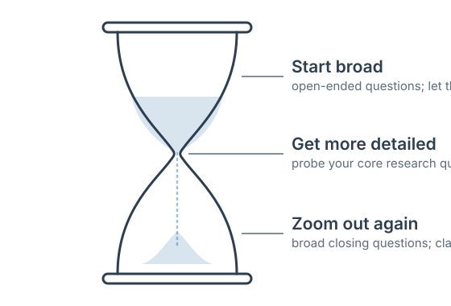

# Conducting Expert Interviews: A Guide

Expert interviews are the centerpiece of the [student cases](./). This guide walks you through the full arc of an interview: deciding why you are doing it, choosing who to talk to, reaching out, preparing, conducting the conversation, and writing it up afterward. It works whether you are taking the course on your own or with a class, and the skills it teaches—preparing for a conversation with someone who knows more than you do, listening well, and turning what you hear into analysis—will serve you far beyond this course.

---

## Why conduct interviews at all?

With so much published material available on any region, it is fair to ask why you should go to the trouble of talking to people. Three reasons.

**Understanding.** Interviews give you access to the things documents rarely capture: context, history, power dynamics, causal mechanisms, and the tone, emotions, and human side of a place. A report can tell you a policy exists; a person can tell you why it was designed the way it was, who fought over it, and how it actually works on the ground.

**Discovering.** Interviews surface unintended consequences, ideas and data that have not yet been shared publicly, and—most valuably—the things you don't know you don't know. Every research project has blind spots. A good interview is one of the fastest ways to find yours.

**Synthesizing and refining.** Interviews help you understand the story behind quantitative data, fine-tune the variables you focus on, and sanity-check your current understanding. They are how you find out whether the picture you have assembled from published sources matches the picture held by people who live and work in it.

---

## Types of interview structures

Interviews range from completely open-ended to fully scripted:

- **Unstructured (open-ended)** interviews are useful when you want to build theory and explore subjective human experiences.
- **Semi-structured** interviews are useful when you want to understand causal pathways and system dynamics, test hypotheses, or compare cases. This is the most common structure for expert interviews, and the one we recommend for the student cases.
- **Structured surveys** with some shorter open-ended questions are useful when you want to gather quantifiable data from a large number of respondents.

A semi-structured interview means you arrive with a written guide of the questions and topics you want to cover, but you let the conversation breathe—following interesting threads, skipping questions the interviewee has already answered, and returning to your guide to make sure nothing important gets missed.

---

## Who counts as an expert?

For the student cases, an expert interview means a conversation with someone who has specific expertise or knowledge of the dynamics of your region. Experts can be academics, policy makers, community leaders, journalists, business leaders, or anyone else you believe would have a thoughtful perspective on your questions.

Who counts as an expert depends on your research question. Formal credentials are not required; lived experience and informal training are often even more important. A farmer who has watched land-use change over thirty years may know things no published study captures.

A few things to consider when selecting interviewees:

- Look for deep or specialized knowledge of your topic.
- Look for people responsible for the development, implementation, or oversight of a policy, strategy, or program—or with privileged access to information about how decisions get made.
- The best interviewee is often not the "boss" or highest-level leader, but the managers right below, who tend to know the operational detail and have more time to talk.
- Choose someone likely to be willing to share a nuanced perspective and able to devote time to an interview.

Expert interviews have practical advantages too: experts hold aggregated knowledge, they tend to have extensive networks that can lead you to other interviews, they are usually motivated to exchange ideas, and they are less likely than other interview subjects to be swayed by how you phrase your questions.

---

## The interview process

### 1. Reach out

Identify the people you want to interview and contact them with a clear, professional email (or phone call). Your email should cover:

- Who you are
- What your project is
- Why you are reaching out to them specifically
- How much of their time you are asking for (fifteen to twenty minutes is a reasonable request; many conversations will run longer once they get going)
- How you propose to meet (video call, phone, or in person—use whatever technology your interviewee is most comfortable with)

Reach out earlier in your research rather than later; scheduling always takes longer than you expect. And do not be shy about contacting people who seem out of reach. You will be surprised, if you send a polite and informed email, how many people—even those quite senior in their fields and organizations—are happy to share what they know with a serious student.

### 2. Prepare in advance

Do your legwork before the conversation, not during it. Learn as much as you can about the person and their work:

- **The person:** their background, and where their biases and blind spots might lie. Everyone has them.
- **The topic:** what they have written or said publicly, so you don't spend your limited time asking things you could have looked up.
- **Their organization:** its accomplishments, its place in the broader ecosystem, its relationships with other players, and any relevant recent news—a new project, partnership, or strategic plan.

Draw on a range of sources: the person's own website and social media, academic databases like Google Scholar, industry publications, and journalism or podcasts.

If you are working with others, decide roles in advance. We have found that two or (at most) three people is the right number for conducting a video-call interview. Share responsibilities—introductions, note-taking, time-keeping, question-asking—and designate a lead interviewer (which does not mean others cannot also ask questions).

Then prepare a written interview guide. We like to think about interviews, and the guides that structure them, as hourglasses:

The hourglass method for structuring an interview.

**Beginning: start broad.** Ease in with open-ended questions—"How did you get involved in this work?" or "What are the most interesting recent developments in your field?" It often helps if the first question lets the respondent answer in narrative form and tell you part of their story. This puts your interviewee at ease, signals that you are genuinely interested rather than just extracting what you need, and frequently surfaces surprising things. The more the interviewee feels respected and listened to, the more they will share.

**Middle: get specific.** Pursue ideas in more depth and work through your core research questions. Probe, but don't lead: "That is really interesting—tell me how that works" is a probe; "Don't you agree that this policy failed?" is a lead. Toward the end of this section, you can bring in theories or frameworks from your research and ask how they map onto the interviewee's experience.

**End: zoom out again.** Ask broad questions that let the interviewee answer creatively now that they understand the themes you care about, and seek clarification on anything still unclear. "Is there anything else you think we should know?" is a genuinely useful closing question, not a formality.

### 3. During the interview

**Kickoff.** Create rapport. Thank the participant for their time, do introductions, explain your project and the goals of the call, and confirm how long they have—then keep track of time. Review confidentiality (see below), and if you want to record, ask first.

**Confidentiality and discretion.** Ask your interviewee whether they are willing to be named in your final memo or would prefer to remain anonymous. Expert interviewees are often fine being identified by name—but not always, so always ask. Let them know they will have the opportunity to approve any direct quotes before you use them.

**Balance.** Let the interviewee lead the discussion, but make sure you get to the questions that matter to you. It is fine to pivot politely: "This is really interesting. Since we only have twenty more minutes and there are a few more things I'd love your thoughts on, can I ask you about X—and hopefully we can come back to this after."

**General guidance.** Ask follow-ups ("Can you share an example of that?"). Avoid leading questions. Avoid jargon. And never argue with an interviewee—you can disagree in your analysis, but not while collecting the data.

**Closing.** Ask if there is anything you missed and whether they have questions for you. This is also the moment to ask whether there are other people they think you should talk to—this "snowball" approach is one of the best ways to build your interview list. Offer to send them your final memo.

### 4. Follow up

Send a thank-you note. This is also a good time to clarify anything that was confusing, ask a brief follow-up question, or request additional contacts.

Then write up your notes—within 12 to 24 hours. It is amazing how fast we forget. Your write-up should be rough rather than verbatim, organized question by question, capturing potential quotes and skipping anything that doesn't add value to the research. Put a short summary of key findings at the top: the overarching themes, what most supported or challenged your expectations, and what the biases or blind spots of your interviewee might have been. If you conducted the interview with others, write the notes up together.

---

## A note on research ethics

The guidance above covers the norms of respectful expert interviewing: informed participation, the option of anonymity, and approval of direct quotes. If you intend to use your interviews in formal research for publication—rather than for coursework or your own learning—check whether your institution requires human-subjects review before you begin.

---

## Further reading on qualitative interview methodology

- Barney Glaser and Anselm Strauss. 1967. *The Discovery of Grounded Theory: Strategies for Qualitative Research.*
- Kathy Charmaz. 2006. *Constructing Grounded Theory: A Practical Guide to Qualitative Analysis.*
- Robert Weiss. 1994. *Learning from Strangers: The Art and Method of Qualitative Interview Studies.*
- Gary Henry. 1990. *Practical Sampling.*
- Kristin Luker. 2008. *Salsa Dancing into the Social Sciences: Research in an Age of Info-Glut.*

---

*This guide was originally developed by Alicia G. Harley and Sam Elghanayan for the Harvard course on which this open course builds.*
