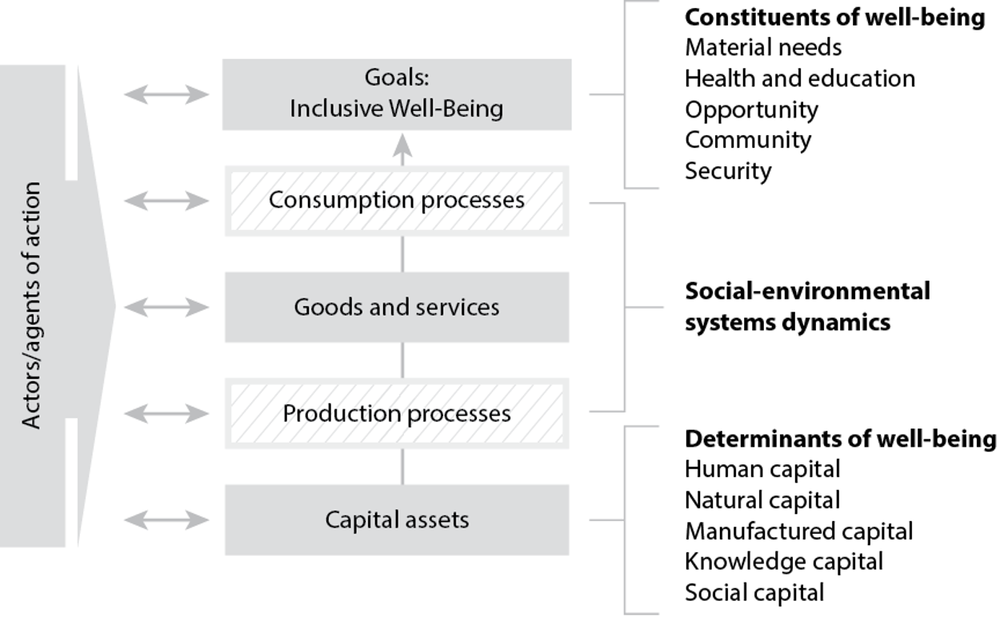

The variety of complex interactions between human development and the natural environment make it difficult to identify actions that support the pursuit of sustainability. A growing body of scientific research, however, can help. Part I of this course develops a simple framework you can use for harnessing that research for sustainability analysis. This Unit provides an overview of that framework. Subsequent units expand on it by introducing additional elements and relationships that science has shown to be important in understanding social-environmental systems and shaping decisions in pursuit of sustainability.

---

Figure 1: A Framework for Sustainability Analysis (Matson et al., 2016)

---

The framework presented in the readings (and reproduced in figure 1 above) provides a way to analyze sustainability challenges. At the top, it shows human well-being—the ultimate goal of sustainable development. On the bottom, it shows the resources that serve as capital on which people can draw to reach their goals. Connecting these are the social-environmental (nature-society)1 systems that shape the dynamics of planet earth. The framework emphasizes the processes of production and consumption that, within the overall social-environmental system, are the focus of most human interventions. Those interventions are taken by actors: individuals, firms, communities, states. As you'll see in the readings, understanding these relationships is key to identifying interventions that can advance sustainability.

> **A cautionary note:** The field of sustainability science is rapidly advancing, drawing on findings in multiple disciplines. This means that the frameworks we present here are far from the only ones being used around the world – they're just the ones we have found to be most inclusive and useful. And even "our" frameworks are in flux, with the early version set forth in the Matson et al. book (see reading 'a') extended substantially in the more recent versions we introduce in Part II. Future research and experience will doubtless lead to additional refinements and improvements.

---

## Preparation for class

To prepare for the class, please:

**a) Read:**  
Matson, P., Clark, W. C., & Andersson, K. (2016). Pursuing Sustainability: A Guide to the Science and Practice. Princeton University Press.  
Read "A framework for sustainability analysis…" (pp. 14-20, top of page).  
> This reading provides a concise summary of the early version of the framework we use in this course (reproduced above). It is important to read carefully because it introduces some of the most important ideas and terminology that the authors used throughout the book and that we adopt in later Units.

**b) Read:**  
Thompson, M. (2021). [The Alaskan Salmon Fishery: Managing Resources in a Globalizing World](https://www.michaelathompson.net/work). Harvard University. Available in the course library [HERE](../course-library/teaching-cases/case-alaska.pdf). pp. 1-25.

---

## Study Questions to help you get the most out of the readings

**I. Nature-society interactions:** The framework presented in figure 1 and detailed in reading 'a' shows the social-environmental (aka nature-society) system on the right side. For the Alaska salmon fishery, identify the main components of this system (both natural and social) and sketch how they interact. What are the key two-way relationships between salmon ecosystems and human communities?

**II. Goals:** What are the most intensely felt goals held by various groups in the Alaska salmon fishery? Consider fishers, processors, Native communities, conservationists, and the state government. How do these goals align and where do they conflict?

**III. Resources:** The framework highlights "capital assets" (also referred to as natural and anthropogenic resources in this course) as the ultimate source of human well-being. What capital assets (natural, human, manufactured, social and knowledge) are most important to changes human well-being that occur in the course of the Alaska case?

**IV. Consumption-production system:** The framework highlights the consumption and production processes through which people harness the resources of the nature-society [social-environmental] system to achieve their goals for a good life. In Fishbanks, what is the relevant consumption demand and how is it set? What are the key production processes? How are consumption and production processes related? Think through the same questions for the Alaska fishery case. What seems to drive changes in salmon abundance from year-to-year and how do humans respond?

**V. Preliminary sustainability assessment:** From this first look at the Alaska fishery case, what do you see as its prospects for sustainable development? What aspects of the system are enhancing those prospects? What aspects raise concerns? (Note: You'll revisit this question with increasing sophistication in Units 1.5 and 2.7 as you develop more analytical tools).

---

## Footnotes

1 *Note that in the more recent literature, an equivalent term to the one used in the figure has been introduced: the nature-society system. We will use this more recent terminology going forward, but both mean the same thing—the integrated systems formed by the co-evolution of human societies and the natural environment.*

